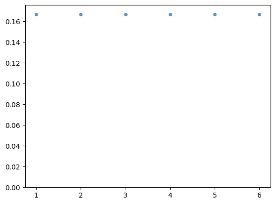
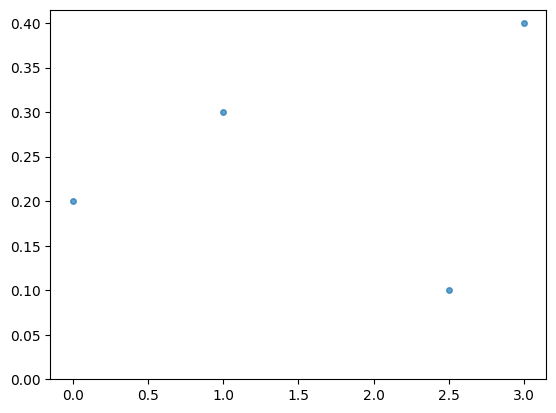
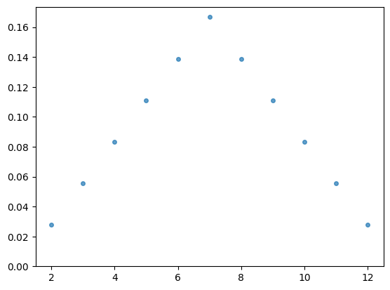

[](https://opensource.org/licenses/Apache-2.0) 


# probability_calculator

Calculate with and analyze probability densities.

## Usage

Install the package, e.g.: `pip install probability_calculator`.

### Initialization and plotting

The package provides simple ways to define discrete densities, for instance a die:


```python
from probability_calculator.density import Die

density = Die(6) # initialize a fair die with 6 sides
fig, ax = density.plot() # plot the density using matplotlib
```


    

    


For the general case, the class `DiscreteDensity` can be used:


```python
from probability_calculator.density import DiscreteDensity

density = DiscreteDensity(outcomes=[
    { "value": 0, "p": 0.2 },
    { "value": 1, "p": 0.3 },
    { "value": 2.5, "p": 0.1 },
    { "value": 3, "p": 0.4 },
]) # initialize a discrete density with 4 different outcomes
fig, ax = density.plot() # plot the density using matplotlib
```


    

    


### Combine discrete densities

The discrete density of throwing a die two times can be modelled by multiplying the density with itself:


```python
density_for_one_throw = Die(6)
density_sum_of_two_throws = density_for_one_throw * density_for_one_throw # same as density_for_one_throw**2
fig, ax = density_sum_of_two_throws.plot()
```


    

    


Note that the operations on densities are defined in a way to comply with operations of [probability-generating functions](https://en.wikipedia.org/wiki/Probability-generating_function).
This means multiplication of densities return the density of the sum of the two underlying random variables.

## Limitations

Continuous densities are not supported at the moment.

Multiplying a lot of densities might get stuck due to a lot of possible outcomes. In general, multiplying 10 densities with 10 outcomes each lead to $10^{10}$ outcomes. However, simple cases like the die work, so even `Die(10)**100` is no problem.


## Contributing
We greatly appreciate fixes and new features for [probability_calculator](https://github.com/HendrikRoehm/probability_calculator). All contributions to this project should be sent as pull requests on github.

## License

[Apache License 2.0](LICENSE)
